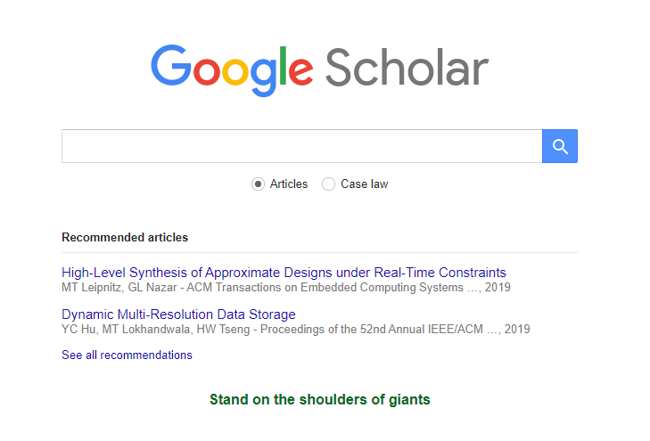
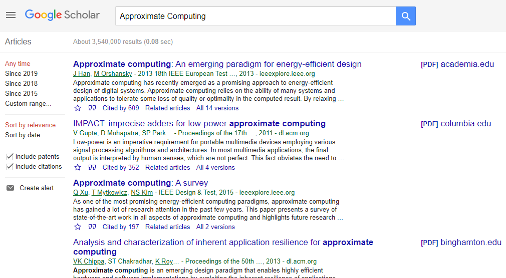

Every decent research should start with reviewing recent work on the field.
Where to start? Considering the vast amount of information available, this task may seem a bit tricky.

Surprisingly, I have met quite a few students who did not know where or how to start this task. Therefore I will provide in this post initial instructions on how to find academic papers for your research.

# Where can I find the literature on my field?

Each scientific domain has a different format of demonstrating its scientific advancements. In Computer Science (CS) and in Electrical Engineering (EE), works are commonly 
- presented in events (conferences, symposiums and workshops) and published in the *proceedings* of the event;
- published in journals.

These conference proceedings and journal papers are commonly indexed and grouped together into platforms. Again, for CS and EE, these two platforms would be the [ACM Digital Library] and [IEEE's IEEEXplore]. Other major publishers include [Springer] and [Elsevier].

Access to these websites is often restricted to the just the title, author list and abstract of each work.
To download the papers themselves, you need to either

1. pay for it;
2. access the webpage through the network of a publisher's partner (for example, your university);
3. contact the authors and request them the full text.

Some events and journals in these two fields are sponsored by the [ACM], some by the [IEEE], and sometimes by both of them. However, what usually happens in that published paper end up either being indexed in [ACM Digital Library] or in [IEEEXplore].

What I usually do then is not to rely on these systems, but rather on [Google Scholar], which aggregates the papers from multiple sources into a sigle platform. It also has the advantage of being really, really intuitive to use.

## Google Scholar

This is the interface of Google Scholar. Pretty much like Google, right? Except it will only provide you with academic papers.

You can do searches here just like you would with Google. Say I want to search for papers on Approximate Computing:

In the center of the screen you are presented with the paper titles, list of authors, source of the publication (i.e., name of the proceedings or journal), year and the database it is indexed at.
Below each paper, you are also presented with the number of work that cite that search result, and a button to find related articles. Pretty useful, right?
When the PDF is available somewhere, a link is also displayed on the right side.
Finally, a filtering feature is presented on the left side, allowing one to sort papers by date and also select only papers in a given time range.

# Proposed approach for looking for literature on your field

Here is a generic approach to doing literature review and some tips to help you along the way.

1. Search for a keyword in Google Scholar. 
2. Subset the search results by their title. Select 20-30 papers.
3. Further substep these papers by reading their abstract. Select 5-10 papers. How are the approaches different?
4. Read these works. Do all of them address the exact same problem? Is the level of abstraction the same? Is the methodology the same? Are the proposed approaches different? 
5. See the works that are pointed to by the ones you just read. Use these pointers to dig one level deeper.

Loop.

## Search for Surveys

A survey is essentially a long paper describing the state-of-the-art in a given field, and is usually published in a journal.
Reading surveys provides an excellent way to getting started in a new field, since they tend to describe the problem at hand, the advancements, the most recent work in the field, and the open problems.
The [ACM] features a publication dedicated only to surveys, the [ACM Computing Surveys].

## Search for recent work:

Recent work usually has more value than old work.
If you cannot find recent work on a given topic, that means that the problem has either been solved or the solutions have reached a limit.
In any case, Google Scholar filter-by-time-range option is a useful one that allows checking for recent papers.

## Search for particular authors (Google Scholar Profiles)

Paper authors can have their profiles open in Google Scholar, with a short bio and also topics of interest. You can access their bio by clicking on the links provided in the search results. 
There you can see the most recent papers the author has published, as well as his network of collaborators.

You can also [set up your own Google Scholar profile](https://scholar.google.com/intl/en/scholar/citations.html).

# Conclusions

In this post, I have provided an introduction to how to use Google Scholar for searching online for papers from a given field, and provided an overview of how to approach the "searching for related work" process. 

I hope you find this post useful in carrying out your related work research.

[Google Scholar]: https://scholar.google.com
[ACM]: https://acm.org
[IEEE]: https://ieee.org
[IEEE's IEEEXplore]: https://ieeexplore.ieee.org
[IEEEXplore]: https://ieeexplore.ieee.org
[ACM Digital Library]: https://dl.acm.org
[Elsevier]: https://www.elsevier.com/
[Springer]:(https://www.springer.com/
[ACM Computing Surveys]: https://csur.acm.org/
