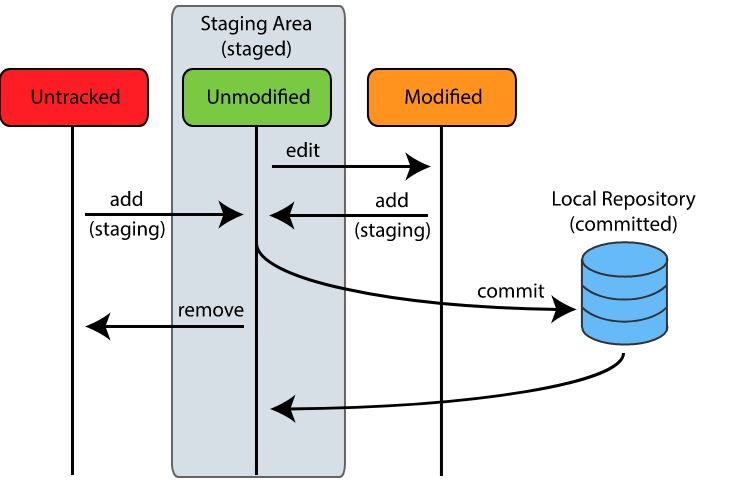
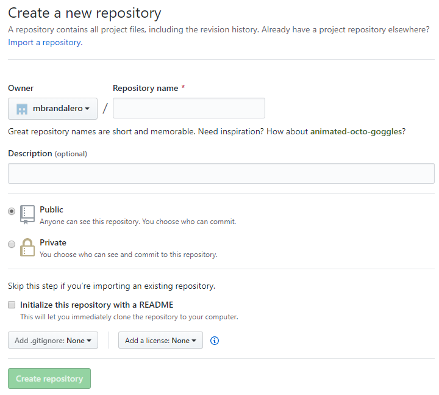
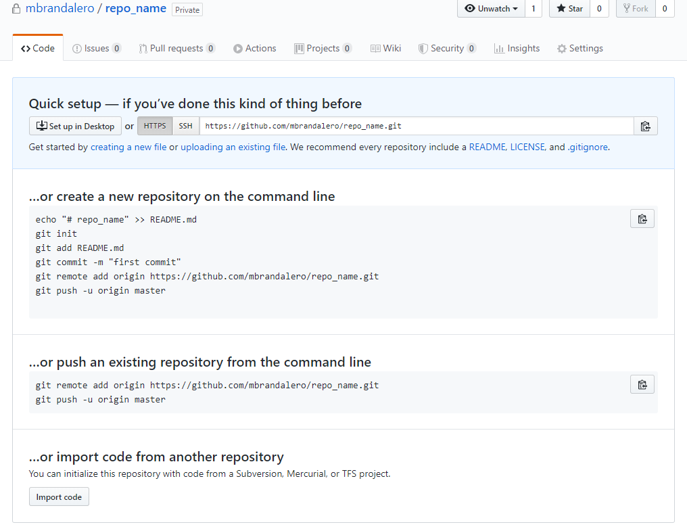

If you work with software for some time, it is very likely you have already encountered *git* or some other form of version control system (*svn, mercurial*). I highly recommend anyone working with software development, scripts, hardware development, or **anything that relies on text or data files evolving over time (*hello* researcher colleagues)** should learn how to use git.

git is a *distributed version control system.* Two terms here deserve explanation:

- *version control:* a version control system is like a ledger, where you can keep track of what is changing over time. In the case of git, you use this to keep control over a set of files and how they evolve over time. That means you are able to check modifications that were introduced to files over time and revert those changes, for example when a bug shows up!


- *distributed:* means there is no *centralized* repository acting as coordinator; rather, each individual copy of a *repository* (the set of files that are being kept control of) is complete on its own. ("but what about these websites like *github* and *bitbucket*? I will explain that further down the post).

I am a fan of practical examples, so rather than explaining what each command does I'll give you a hands-on approach. This tutorial flows in the way you would (probably) naturally get to learn git commands if you were out there and had to get your hands dirty anyway. As an introductory post, here's some basic commands that I will cover:

- **cloning** a repository (`git clone`)
- **inspecting** a repository (`git status`, `git log`)
- **working with files**, **commiting** and **pushing** (`git add`,  `git commit`, `git push`)

# Cloning a git repository

The command `git clone <repository_url>` does a **clone** operation, which is exactly what its name suggests: it creates, *locally*, an exact copy of the repository whose path is given by `<repository_url>`. 

I have prepared a repository for us to use in this example. Go ahead and try cloning the source files for that by executing `git clone git@github.com:mbrandalero/git_tutorial`. This will create in your local directory a `git_tutorial` folder, which is an exact copy of the repository located at `github.com/mbrandalero/git_tutorial`.  `cd` into it.

# Inspecting a git repository

Two fundamental commands for inspecting the files and status of a repository are `git status` and `git log`.

## Viewing the current repository status

`git status` gives you an overview of your current status. After cloning the repository, you should see something like this:

```bash
[mbrandalero@vm git_tutorial]$ git status
On branch master
Your branch is up to date with 'origin/master'.

nothing to commit, working tree clean
```

A few information here:

- A *branch* represents, roughly speaking, a fileset within the repository (one repository can have multiple sets of files, i.e. branches). The default *branch*, by convention, is always called master. It can be used, for example, for separating filesets associated with a *stable* and a *development* version of the same code. For now, we just take the master branch for granted - I will cover branches in a future update to this post.
- *This branch* is up to date with `origin/master`. o**rigin** is the name of a *remote* (as you correctly guessed, the name of a remote location) and **master** is the name of the *branch* in the *remote* **origin.** This message tells you that your files are synchronized with the remote repository, ***to the best of your git client's knowledge.***
    - Note that *git* does not work in an automatic way like cloud synchronization clients such as OneDrive and Dropbox. Synchronization must be made explicitly via some commands we will cover later, such as `git fetch`, `git pull` and `git push`. That means that a change may also have happened in your remote location, but yet git is unaware of that.
- The last message tells you that your *working tree* (the set of files that are being kept track of) is clean; that is, nothing has been modified, and nothing is *staged for commit*.
- A *commit* is a transaction on the git history. Roughly speaking, git performs version control efficiently by tracking only the changes between different commits. A commit then represents a set of files that were changed, along with those changes.

## Viewing the current repository log (all commits)

`git log` allows you to view the latest *commits* that were done in the repository. When running it, you should see something that looks like this:

```bash
[mbrandalero@vm git_tutorial]$ git log
commit 172345d78eb8f615c1bba579f411dddc17ccf7e3
Author: Marcelo Brandalero <marcelo.brandalero@emailhidden.de>
Date:   Fri Apr 10 11:37:20 2020 +0200

    Create file2.txt

commit 2ef6d1d322c6bfefa60a3eea1ce9c47b2b27b3e8
Author: Marcelo Brandalero <marcelo.brandalero@emailhidden.de>
Date:   Fri Apr 10 11:36:52 2020 +0200

    Create file1.txt

commit 84a3d776e0706630306cce5e6ef414bceab3592e
Author: Marcelo Brandalero <marcelo.brandalero@emailhidden.de>
Date:   Fri Apr 10 11:36:02 2020 +0200

    Create README.md
```

On the top you see the most recent commit, on the bottom you see the least recent. This command is useful to check the latest changes introduced to the current file set.

The first line indicates that the most recent commit was done by me on Apr 10 18:31:08 2020 +0200, and this commit has a hash value *172345d78eb8f615c1bba579f411dddc17ccf7e3*. This is a unique identifier for the commit, and is useful to have if you need to access some file from this commit later on.

Let's go ahead and start working with the files.

# Working with files in the repository

You should see in the `tutorial` folder two files. Go ahead and:

- modify *file1.txt* as you like
- create a new *file3.txt* as you like

Now run `git status .` in the root of the repository again. You should see something like this

```bash
[mbrandalero@vm git_tutorial]$ git status
On branch master
Your branch is up to date with 'origin/master'.

Changes not staged for commit:
  (use "git add <file>..." to update what will be committed)
  (use "git restore <file>..." to discard changes in working directory)
	modified:   tutorial/file1.txt

Untracked files:
  (use "git add <file>..." to include in what will be committed)
	tutorial/file3.txt

no changes added to commit (use "git add" and/or "git commit -a")
```

Files in your git repository may be in a few different situations. This is a good time to introduce the **staging area.** As I wrote earlier, a *commit* represents a set of transactions, a set of modifications in files which will be tracked and labeled with a commit hash. The **staging area** is the place where you put the files that will be *committed*. So the process is like this:

1. Modify or create a file
2. Add it to the staging area
3. Commit

We just did step 1 above. Now our two files are in the following situation:

- *file1.txt:* this is a file that git was already tracking before, as it was included in a previous commit. i.e., it is part of the current commit, also called the HEAD of the repository. Since git detected a change, it lists this file as modified, but not staged for commit.
- *file3.txt*: git has detected that this file is new (it is not part of the HEAD of the repository), and git is not tracking changes to it. That's why its status is listed as untracked.

To add these files to the staging area, run `git add tutorial/file1.txt tutorial/file3.txt`. You should now see the following updated status:

```bash
[mbrandalero@vm git_tutorial]$ git status
On branch master
Your branch is up to date with 'origin/master'.

Changes to be committed:
  (use "git restore --staged <file>..." to unstage)
	modified:   tutorial/file1.txt
	new file:   tutorial/file3.txt
```

Before we continue, I leave here a figure which I steal from  [https://code.snipcademy.com/tutorials/git/fundamentals/three-states-areas](https://code.snipcademy.com/tutorials/git/fundamentals/three-states-areas), which also provides additional information on the topic.



# Committing your changes

**Commit** represents the process of completing a transaction in your repository and registering those changes, so that, in the future, you may return to these.

You commit changes to a repository by using the command `git commit -m "Your commit message."` . Depending on your coding style, you may use different types of commit messages. Notice that the set of file changes is automatically tracked by git, so it is probably more useful to include in your commit message a summary of what was changed or why it was changed. For example, while changes in your code will be tracked by *git,* tracking the reason for that is up to you. Does the current commit fix a bug or implement a new feature? Is it part of the solution? These are all useful information to include in the commit message. 

After running the above command, you should see the following output:

```bash
[mbrandalero@vm git_tutorial]$ git status
[master 1d14291] "Your commit message".
 2 files changed, 4 insertions(+)
 create mode 100644 tutorial/file3.txt
```

Notice the following:

- *1d14291* is a shortened version of the hash associated with the current commit. This is the *id* of the commit and, as mentioned earlier, can be used later on to rever to this specific "snapshot" (the commit) of the file set.
- two files were changed, and the "4 insertions" message means that 4 lines were added to git. git tracks changes on a line-by-line basis, which makes it perfect for efficiently storing source code and data set, and not so efficient for binary files.

Notice that *commit* only updates your local copy of the repository, not the remote one. Separating these two things is a very nice feature of git: it allows you to work on your own speed in implementing features and solving bugs, making intermediate commits as you wish, and allowing you to update the remote copy only when you have a stable version. 

# Pushing your changes

**Push** is the process of actually sending your local changes to the repository to the remote location. Which remote location? The one you just cloned the repository from, or a new one you can register. Since I don't want to risk you breaking this very nice tutorial that I have prepared, I am going to show you how to **register a new remote** and uploading your changes to this new place.

## Registering a new remote

Your new remote can be located in one of the available online repository hosting services such as github or bitbucket, or can even be in another server. We'll stick with the simple approach of uploading your code to github.

First, [register/log in here](https://github.com/login) and follow the steps on the website to create a new repository. You will first have to fill a screen that looks like this (after finding the "create repository" button which can be seen all over the website):



The steps above should be pretty self-explanatory. For the purposes of this tutorial, make sure you **don't** check the "Initialize this repository with a README" box. After you create the repository, you'll land upon such a page:



Well, the steps are already describe here. So what we want to do is push an existing repository (your local, updated repository) to this newly-created remote one. We will do one small modification to this command: since you cloned the local repository from the web, it already has a remote with the name `origin`. Go ahead then and execute the `git remote add new-origin <your_remote_address.git>` to register the new remote.

## Pushing your changes to the new remote

Finally, just run `git push -u new-origin master` to push your local changes to your newly-created remote repository. You should see your repository online after the command executes, along with something that looks like the following lines in the terminal output:

```bash
[mbrandalero@vm git_tutorial]$ git push
Enumerating objects: 8, done.
Counting objects: 100% (8/8), done.
Delta compression using up to 2 threads
Compressing objects: 100% (4/4), done.
Writing objects: 100% (5/5), 450 bytes | 450.00 KiB/s, done.
Total 5 (delta 1), reused 0 (delta 0), pack-reused 0
remote: Resolving deltas: 100% (1/1), completed with 1 local object.
To github.com:mbrandalero/git_tutorial
   f36c568..1d14291  master -> master
```

# Conclusions

In this short post, a brief introduction to *git* was presented. You should know how to use the following basic commands:

- `git clone`
- `git log`, `git status`
- `git add`, `git commit`, `git remote`, `git push`

In a future post, I will show you how to work with branches (`git branch`), revert to past commits (`git checkout`) and merge code (`git merge`) from different branches. I hope you found this tutorial useful!
